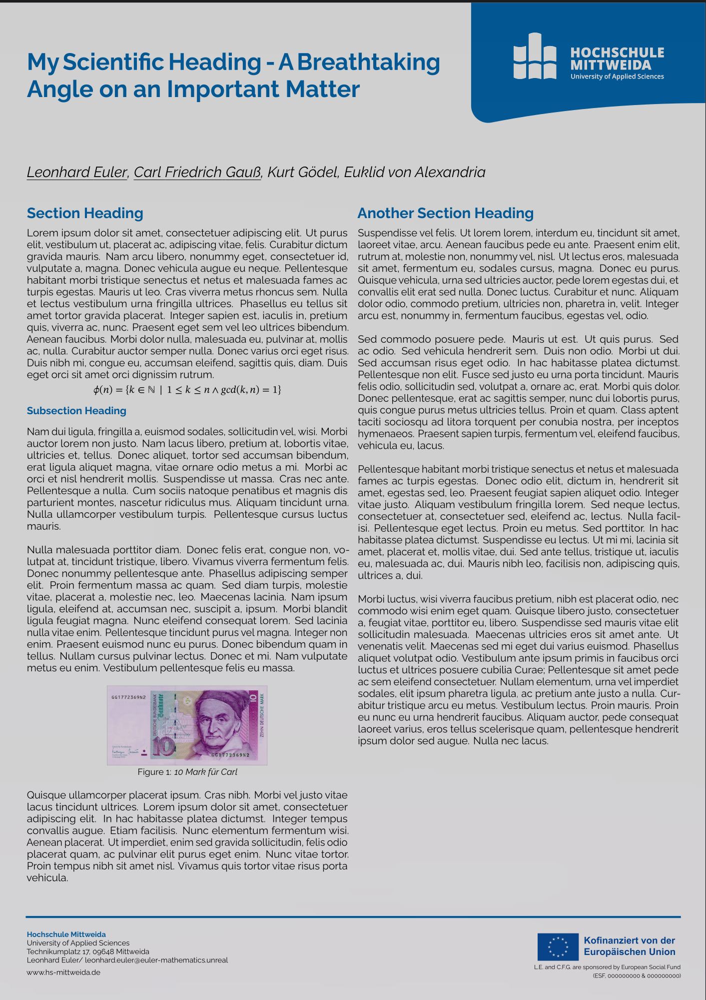
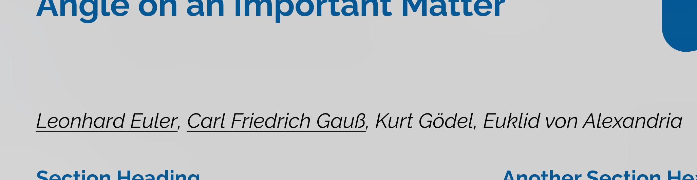
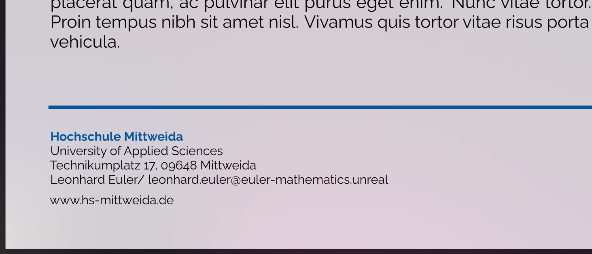
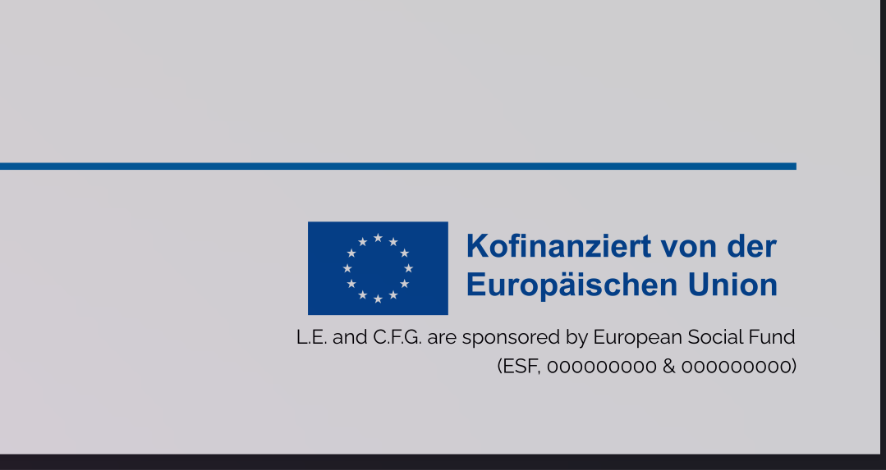
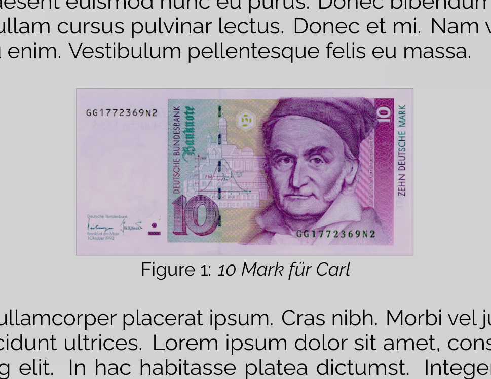

# Useage

Following the official design mostly. Using `Raleway` font instead of `open sans`. **Sections are currently not auto-numbered**


## Authors
- add mainauthors with `\mainauthor{Leonhard Euler}`
- add coauthors with `\coauthor{Kurt Gödel}`



## Correspondents
- add main correspondent with `\correspondent{Leonhard Euler}`
- add email correpondence with `\email{leonhard.euler@euler-mathematics.unreal}`



## Sponsors
- add sponsors with `\begin{sponsorblock}...\end{sponsorblock}` environment
```latex
\begin{sponsorblock}
  \hfill 
  \begin{minipage}[t]{0.30\textwidth}
    \raggedleft
    \includegraphics[width=\linewidth]{./sponsor/esf.jpg}
    {\fontsize{20}{22}\selectfont L.E. and C.F.G. are sponsored by European Social Fund \\(ESF, 000000000 \& 000000000)}
  \end{minipage}
\end{sponsorblock}
```



## Figures
- add figures with `\begin{staticfigure} ... \end{staticfigure}` just like with the `figure` environment.




