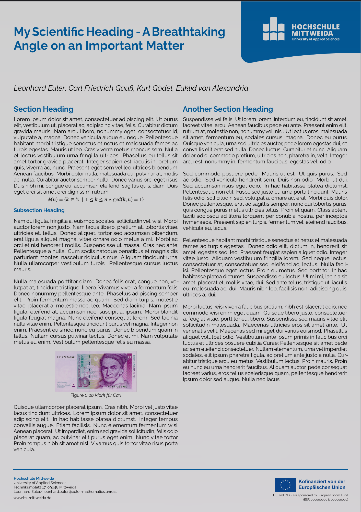
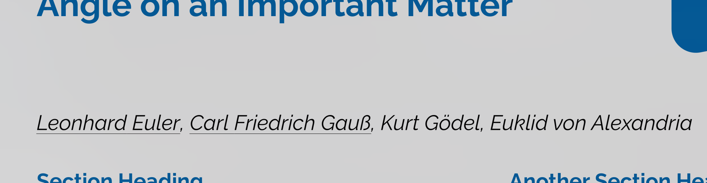
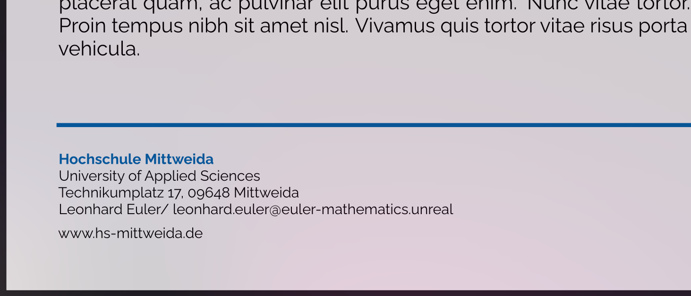
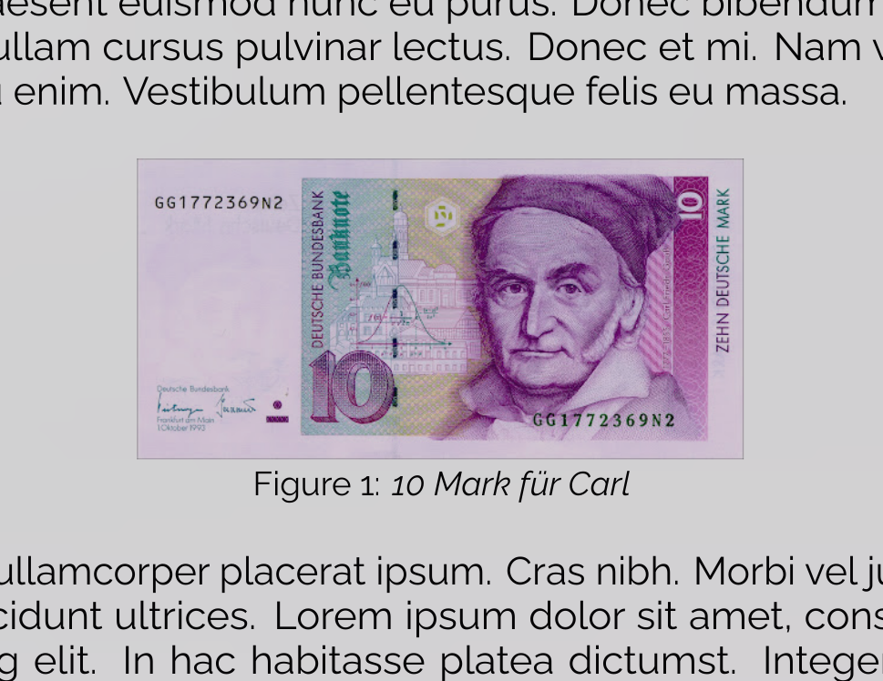

# Useage

**Compilation with lualatex!**

```bash
lualatex a0_poster.tex
```

Following the official design mostly. Using `Raleway` font instead of `open sans`. **Sections are currently not auto-numbered**


## Authors
- add mainauthors with `\mainauthor{Leonhard Euler}`
- add coauthors with `\coauthor{Kurt Gödel}`



## Correspondents
- add main correspondent with `\correspondent{Leonhard Euler}`
- add email correpondence with `\email{leonhard.euler@euler-mathematics.unreal}`



## Sponsors (Thanks to Thomas Pfaff)
- add sponsors in the document before the \begin{poster} part.
```latex
\SetSponsorTopShift{-10mm}
\AddSponsorBlockHorizontal{./sponsor/BMWE_sponsor_eng.png}{M.K. is supported by the joint project AIMS (subprojects IAI-XPRESS and DAIMLER) funded by the German Federal Ministry for Economic Affairs and Energy\\(BMWE, 50WK2270E )}
\AddSponsorBlockHorizontal{./sponsor/BMFTR_sponsor_eng.png}{T.P. is supported by the project PAL founded by the Federal Ministry of Research, Technology and Space\\(BMFTR, 02L19C300)}
\AddSponsorBlockVertical{./sponsor/esf.png}{S.P. is supported by European Social Fund\\(ESF, 100715238)}
```


## Figures
- add figures with `\begin{staticfigure} ... \end{staticfigure}` just like with the `figure` environment.



## Tables
- add tables wrapped inside an adjustbox
```latex
\begin{statictable}
  \begin{adjustbox}{max width=\columnwidth}
    % your table goes here
  \end{adjustbox}
\end{statictable}
```

## Experimental feature: full width figures in 2-column-layout (Thanks to Thomas Pfaff)
It is possible to display full-width illustrations before or after the text, but only one of the them. The scales and numerical values currently still have to be set manually. 

Bottom-illustration:
```latex
%Reservation of space for illustration
\ReserveBottomFullWidth{0.15\paperheight}
% setup the number of columns (either 1 or 2)
\SetPosterColumns{2}
\begin{document}
...
\end{poster}

%include illustration with manual height-scaling
\begin{bottomfullwidthblock}{0.08\paperheight}
\centering
\includegraphics[width=\linewidth]{figures/schema.pdf}
\captionof{figure}{Schematic representation}
\end{bottomfullwidthblock}

\end{document}
```

Top-illustration-funnctions:
```latex
\ReserveTopFullWidth{0.15\paperheight}
...
\begin{topfullwidthblock}{0.08\paperheight}
\end{topfullwidthblock}
```
